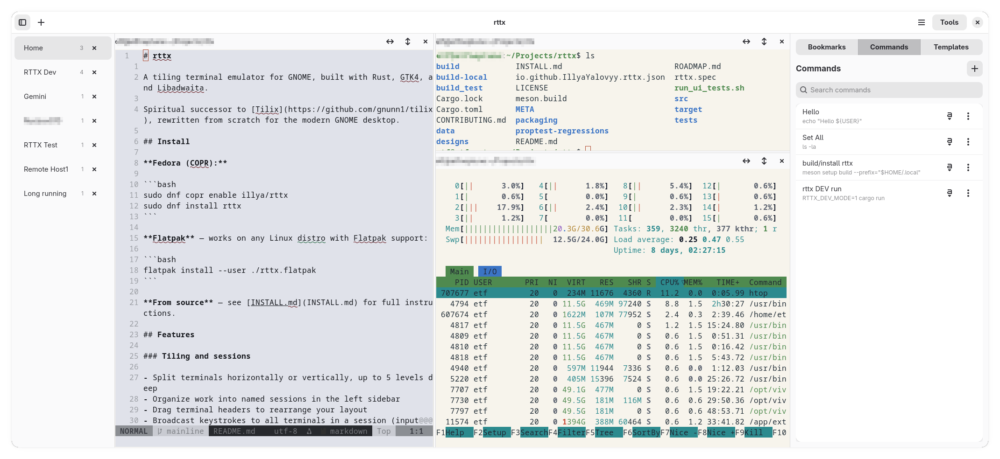

# rttx Monorepo

`rttx` is a tiling terminal environment for GNOME. This repository contains the GUI client, the
daemon runtime service, and the shared wire protocol in one workspace.



## Repository Layout

- `clients/rttx/` — the GTK4 + Libadwaita client package (`rttx`)
- `services/rttx-server/` — the daemon runtime service package (`rttx-server`)
- `protocols/rttx-proto/` — the shared protobuf wire protocol package (`rttx-proto`)
- `packaging/rttx/` — Flatpak, RPM, and other client packaging assets
- `designs/` — architecture RFCs and design notes

Package names stay unchanged even though the repository now uses role-based directories.

## Prerequisites

**Rust 1.85+** (edition 2024), **Meson**, and the GTK4 development libraries.

Fedora:
```bash
sudo dnf install cargo meson pkg-config gtk4-devel libadwaita-devel vte291-gtk4-devel
```

Ubuntu / Debian:
```bash
sudo apt install cargo meson pkg-config libgtk-4-dev libadwaita-1-dev libvte-2.91-gtk4-dev
```

Arch Linux:
```bash
sudo pacman -S rust meson pkgconf gtk4 libadwaita vte4
```

Minimum library versions: GTK4 4.14, libadwaita 1.5, VTE 0.76+ (0.78 recommended).

Check your VTE version — this is the most common build issue:
```bash
pkg-config --modversion vte-2.91-gtk4
```

## Build

Run all commands from the repository root.

Development build for the whole workspace:

```bash
cargo build --workspace
```

Development builds for individual packages:

```bash
cargo build -p rttx
cargo build -p rttx-server
cargo build -p rttx-proto
```

**If your system has VTE 0.76 instead of 0.78** (e.g., Fedora 40, Ubuntu 24.04):

```bash
cargo build -p rttx --no-default-features --features vte-0_76
```

The default feature is `vte-0_78`. If you skip the flag on a VTE 0.76 system, the build will fail
with `vte-2.91-gtk4 >= 0.78 not found`.

Run the client in normal mode:

```bash
cargo run -p rttx
```

Run the client in development mode:

```bash
RTTX_DEV_MODE=1 cargo run -p rttx
```

Run the daemon in foreground for development:

```bash
cargo run -p rttx-server -- start --foreground
```

Run the daemon in development mode:

```bash
RTTX_DEV_MODE=1 cargo run -p rttx-server -- start --foreground
```

## Install

For pre-built packages (Fedora COPR, Flatpak), see [clients/rttx/INSTALL.md](clients/rttx/INSTALL.md).

### Client Only (Meson)

Meson installs the client binary, desktop file, icons, and AppStream metadata.

User-local install (no sudo needed, binary goes to `~/.local/bin/rttx`):

```bash
meson setup build --prefix="$HOME/.local"
meson compile -C build
meson install -C build
gtk-update-icon-cache -f -t "$HOME/.local/share/icons/hicolor"
update-desktop-database "$HOME/.local/share/applications"
```

System-wide install:

```bash
meson setup build --prefix=/usr/local
meson compile -C build
sudo meson install -C build
sudo gtk-update-icon-cache -f -t /usr/local/share/icons/hicolor
sudo update-desktop-database /usr/local/share/applications
```

**If your system has VTE 0.76**, pass `-Dvte_version=0.76` to `meson setup`:

```bash
meson setup build --prefix="$HOME/.local" -Dvte_version=0.76
meson compile -C build
meson install -C build
```

Without this flag, Meson defaults to VTE 0.78 and the build will fail.

**If `build/` already exists**, use `--reconfigure` to change options:

```bash
meson setup --reconfigure build --prefix="$HOME/.local" -Dvte_version=0.76
meson compile -C build
```

**If the build is in a broken state**, wipe and start fresh:

```bash
meson setup --wipe build --prefix="$HOME/.local" -Dvte_version=0.76
meson compile -C build
```

### Daemon Only

Use Cargo for the daemon. Meson does not install `rttx-server`.

The daemon must be on `$PATH` for the client to auto-start it. Without it, daemon-backed
workspaces will fail to connect.

User-local install (no sudo needed, binary goes to `~/.local/bin/rttx-server`):

```bash
cargo build --release -p rttx-server
install -Dm755 target/release/rttx-server "$HOME/.local/bin/rttx-server"
```

Make sure `~/.local/bin` is in your `$PATH` (most distros include it by default).

System-wide install:

```bash
cargo build --release -p rttx-server
sudo install -Dm755 target/release/rttx-server /usr/local/bin/rttx-server
```

### Full Production Install

Install both client and daemon from source:

```bash
meson setup build --prefix=/usr/local
meson compile -C build
sudo meson install -C build
cargo build --release -p rttx-server
sudo install -Dm755 target/release/rttx-server /usr/local/bin/rttx-server
```

`rttx-proto` is a shared library crate and is not installed as a standalone artifact.

## Test

```bash
bash .github/scripts/run-clippy.sh
bash .github/scripts/run-quality-tests.sh
cargo build -p rttx && ./run_ui_tests.sh
```

`cargo test --workspace` is useful for fast daemon/protocol passes, but the GTK-heavy client suite
must be driven through `.github/scripts/run-quality-tests.sh` because GTK widgets require
main-thread-aware isolation.

## Documentation

- [Client overview](clients/rttx/README.md)
- [Daemon overview](services/rttx-server/README.md)
- [Protocol overview](protocols/rttx-proto/README.md)
- [Contributing guide](CONTRIBUTING.md)

## License

GPL-3.0-or-later
